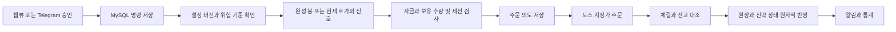

# 구조와 상태 관리

하나의 Python 패키지·컨테이너 이미지를 세 역할로 실행한다.

| 역할 | 책임 | 증권사 주문 권한 |
|---|---|---|
| engine | 시세·캘린더·주문 상태 동기화, 전략, 위험 관리, 시세 수집 | 유일한 보유자 |
| api | 웹뷰, Telegram 인증·명령·알림, DB 조회 | 없음 |
| research | DB에 저장한 시세의 백테스트·후보 비교 | 없음 |

React 웹뷰는 FastAPI가 제공한다. 큐와 감사 기록은 MySQL에 저장하여 Redis·별도 메시지 브로커 없이 명령을 복구한다. Freqtrade의 Telegram·모의매매·백테스트 사용 흐름을 참고하되 주문 규칙은 토스의 실제 제약에 맞췄다. 암호화폐는 후속 증권사·거래소 어댑터로 확장하며 첫 버전에 Binance 주문 코드를 포함하지 않는다.

## 주문 흐름

금액·수량은 Python Decimal과 MySQL DECIMAL로 계산한다. 전략은 `StrategySpec`, 입력 시세는 `Quote`·`Bar`, 판단은 `Decision`으로 분리한다. `decide`와 `apply_fill`을 모의·실거래·백테스트에서 재사용한다. 순서가 다른 데이터 해상도까지 동일 성과를 보장하지는 않는다.

## 실행 중복과 장애

- engine은 MySQL 전용 연결의 `GET_LOCK`을 보유한다. Kubernetes도 `replicas: 1 + Recreate`로 설정한다. 두 조건을 함께 사용하며 연결을 잃으면 프로세스를 종료한다. 실행권을 잃은 프로세스가 자동으로 다시 실행권을 얻지 않는다.
- POST 전 `SENDING`, 최초 제출 시각, 고정 `clientOrderId`를 커밋한다. 동일 키를 재시도하는 시간은 9분 이내로 제한해 토스의 10분 한도에 여유를 둔다.
- 결과가 불명확한 주문이 있으면 다른 종목의 새 주문도 막는다. 전략이 중단되었거나 유효시간을 넘긴 경우 재전송하지 않는다. 증권사 주문 번호를 사용한 수동 대조가 필요하다.
- 중단·위험 한도 도달 뒤에도 이미 제출한 주문의 늦은 체결은 반영한다. 취소 요청 성공을 취소 완료로 취급하지 않는다. DB·네트워크가 끊기면 기존 증권사 주문이 남을 수 있다.
- 누적 체결 수량·금액·비용의 증가분을 원장에 기록하고 동일 스냅샷을 중복 반영하지 않는다. 늦게 확정된 비용은 현금에 차액만 반영한다.
- 기존 보유분이나 수동 주문과 봇 수량이 맞지 않으면 해당 전략을 중단한다. 외부 주문을 자동 취소하거나 사용자 주식을 자동 편입하지 않는다.
- 웹소켓은 시세 전달에 사용한다. 원장 상태는 REST로 대조한다. 재연결 시 구독과 시세를 복구하며 과거 이벤트가 재생된다고 가정하지 않는다.

## 승인과 보안

로컬 UI는 loopback만 허용한다. 운영 UI는 Telegram `initData` 서명·5분 유효시간·허용 사용자 ID를 서버에서 확인하고 1시간의 Secure·HttpOnly 세션을 발급한다. 변경 요청은 Origin을 확인한다. Telegram은 사용자 ID·개인 대화 ID를 모두 검사한다.

승인은 전략 ID·버전·모드·설정·총예산·위험 한도·실거래 허용 여부에 묶인다. 5분 이상 대기한 시작·설정 요청은 다시 확인해야 한다. 중단 요청은 오래되었다는 이유로 무시하지 않는다.

알림은 전송 확인 전까지 다시 시도할 수 있으므로 확인번호를 붙인다. 실행기가 2분 넘게 응답하지 않으면 독립된 API·Telegram 역할에서 알린다. 클러스터 전체 장애는 내부 알림도 중단하므로 배포 전 외부 생존 확인을 준비한다.

## 저장 구조와 운영 통계

`strategies`에 불변 설정과 자금·보유 상태, `order_intents`에 주문 생애주기, `ledger`에 누적 응답의 차분을 저장한다. `commands`는 승인 명령, `events`는 판단·감사·알림, `candles`는 수정 전 시세, `backtest_jobs`는 재현 가능한 검증 결과, `snapshots`는 평가 추이, `runtime_state`는 현재 실행·연결 상태다.

평가금액은 **봇에 배정한 자산**의 현금과 보유 주식 평가 합계다. 증권사 계좌 전체 자산·입출금·배당 자동 회계가 아니다. 시세가 없는 보유분은 평가 불완전으로 표시하고 신규 주문을 보류한다. 첫 버전은 달러로만 손익을 표시한다.
