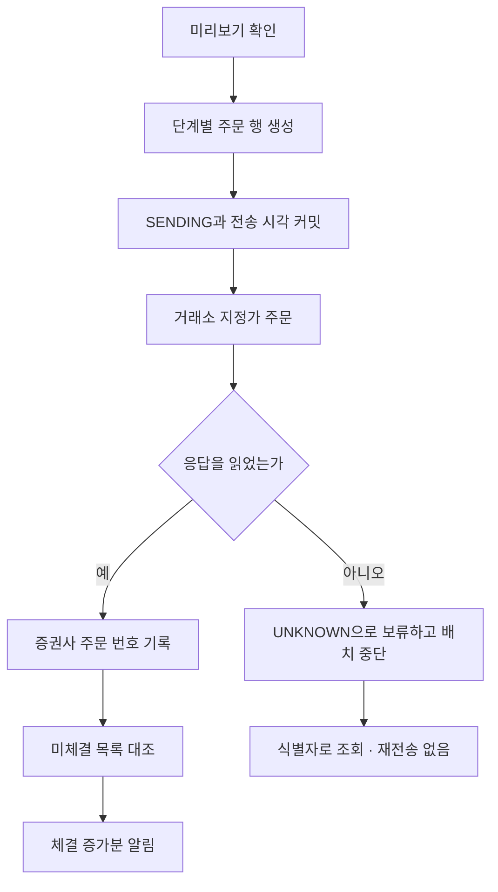

# 구조

단일 Go 프로세스 하나가 전부입니다. 텔레그램을 받고, 거래소에 주문을 보내고, 체결을 대조하고, 알림을 보냅니다.

```
cmd/cotrader          진입점
internal/config       환경변수 로딩과 보안 불변식 검증
internal/market       시장별 호가 단위·수량 단위·최소 주문·종목 코드
internal/ladder       사다리 계산 (순수 함수)
internal/broker       두 어댑터가 공유하는 주문 어휘
internal/toss         토스증권 어댑터
internal/upbit        업비트 어댑터
internal/store        MySQL 스키마·질의·단일 실행 잠금
internal/orders       주문 전송·체결 대조·취소
internal/accounts     잔고 조회와 캐시
internal/transfers    업비트 포켓 간 자산 이동
internal/telegram     Bot API 클라이언트와 화면 요소
internal/app          라우팅·대화 상태·주기 루프
```

직접 의존성은 세 개입니다. `shopspring/decimal`, `go-sql-driver/mysql`, `pressly/goose`. 나머지는 표준 라이브러리입니다. 업비트 JWT 서명도 `crypto/hmac`과 `crypto/sha512`로 직접 만듭니다.

## 동시성

업무 로직은 goroutine 하나에서만 돕니다.

```
goroutine A  텔레그램 롱폴링 → 채널
goroutine B  select {
               업데이트        화면·주문 처리
               3초             미체결 대조와 이체 확인
               60초            잔고 갱신
               2초             알림 발송
               30초            실행 잠금 확인과 하트비트
               30분            버려진 초안 정리
             }
```

모든 상태 변경이 B 한 곳에서 일어나므로 두 작업이 같은 주문을 동시에 건드릴 수 없고, 뮤텍스가 필요 없습니다. SIGTERM은 컨텍스트 취소로 연결되며 진행 중인 전송은 끝까지 기다린 뒤 종료합니다.

## 단일 실행

MySQL 이름 있는 잠금(`GET_LOCK`)을 전용 커넥션에서 프로세스 수명 동안 붙잡습니다. 같은 계좌에 두 인스턴스가 뜨면 사다리가 두 번 나가므로, 두 번째 프로세스는 기다리지 않고 기동을 거부합니다. 30초마다 잠금 소유를 다시 확인하고 잃으면 종료합니다.

봇은 기동할 때 스키마 버전을 읽어 코드가 기대하는 값과 맞는지 확인만 하고, 맞지 않으면 기동을 거부합니다. 적용은 DDL 권한을 가진 별도 Job이 같은 잠금을 쥐고 수행합니다. 항상 떠 있는 프로세스에 자기 테이블을 지울 권한을 주지 않기 위해서입니다.

## 저장 구조

| 테이블 | 내용 |
|---|---|
| `ladders` | 사다리 한 건. 작성 중인 초안도 여기에 들어갑니다 |
| `ladder_orders` | 단계별 지정가 주문과 누적 체결 |
| `transfers` | 포켓 간 이체 |
| `events` | 감사 기록이자 알림 큐 |
| `runtime_state` | 텔레그램 오프셋, 계좌 캐시 같은 작은 상태 |

금액과 수량은 `DECIMAL(36,18)`로 저장하고 코드에서는 `decimal.Decimal`로만 다룹니다. 부동소수점 컬럼 매핑은 만들지 않습니다.

작성 중인 초안이 곧 대화 상태입니다. 텔레그램 `callback_data`는 64바이트라 일곱 개의 파라미터를 담을 수 없으므로, 버튼에는 초안 식별자와 항목만 싣고 값은 데이터베이스에 둡니다.

## 주문 흐름



대조는 시장별 미체결 목록을 주기마다 한 번 읽고, 목록에서 사라졌거나 체결 수량이 달라진 주문만 상세 조회합니다. 요청 수가 주문 수가 아니라 체결 건수를 따라가므로 20단계 사다리도 변화가 없으면 한 번의 호출로 끝납니다. 목록 조회가 실패한 주기에는 아무 결론도 내리지 않습니다.
